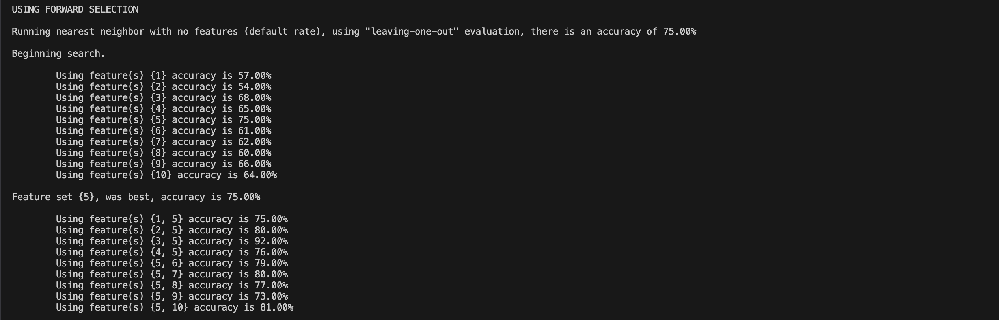
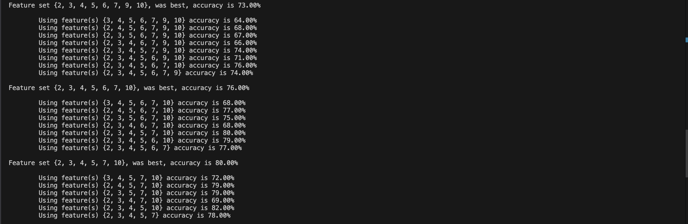

# Best Feature Search

Given a txt dataset, this program will find the set of features that yields the best accuracy using one of the following 2 algorithms. Both algorithms utilize the Euclidean Distance Formula to determine the best accuracy for each iteration:
- ***Forward selection***
    - The algorithm begins with an empty set known as the best feature set. This will be the resulting set of features that yields the highest accuracy.
    - For each iteration, a feature from the selected features will be tested with the current best set. If the addition of the feature yields a higher accuracy than the previous accuracy of the best set, the feature is added to the best set. Otherwise, the feature is not added and the process repeats for the next feature.
- ***Backwards elimination***
    - The alogorithm begins with all selected features in the best feature set. This set will be the resulting set of features that yields the highest accuracy.
    - For each iteration, a feature from the selected features is removed. If the removal of the feature yields a higher accuracy than the previous accruacy, the feature is removed from the best set. Otherwise, the feature remains in the set and the process repeats with another feature in the set.

# How to run:

From the src folder:

***Execute:*** bash main.sh

# Demo

**Forwards Selection:** 

small dataset using features {3, 5, 7}

**Backwards Elimination:** 

small dataset using features {3, 5, 7}

# Project Contribution

This project was in collaboration with two other contributors:
- Joshua Pena
- Truman Fung

<!-- Part 1:

**Compile**: g++ -o main.exe src/main.cpp

**Execute**: .\main.exe

Part 2: From src folder

**Compile**: g++ phase2.cpp classifier.cpp ../header/Validator.hpp

**Execute**: .\a.exe

Part 3: From src folder

**Compile**: g++ main.cpp classifier.cpp 

**Execute**: .\a.exe -->
